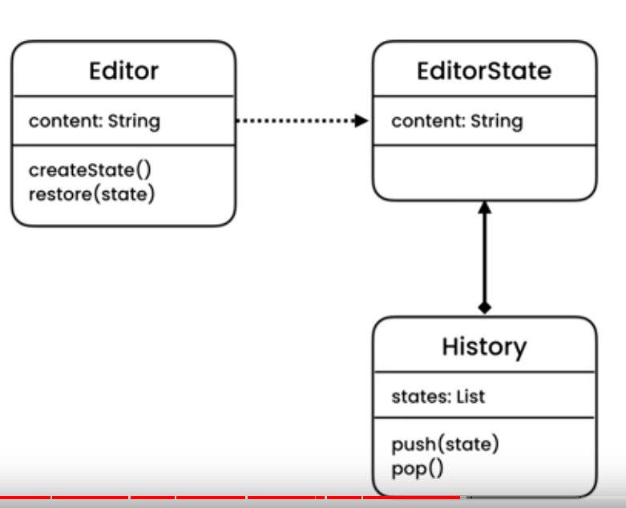

# How Memento Pattern Works

Editor Class has a depnedncy of EditorSTate class and takes it as an arg to createState and restore State

EditorState only has one func; store state and return Content 

> Whenever new content is pushed into the Editor; a new obj of EditorState and made and the current state of the Editor is stored in it and this exact Editor State is passed into the history.push() method

This separation of functions is in alignment with teh Single Responsibility Principle that each class must has a single responsibility

History Class is repsobsible for storing a list of EditorStates and it has push and pop methods;

- for the push method; it takes in a state 
- for the pop method; it returns an EditorState that the Editor then uses to restore the state

These func are only implemented by the Edior Class