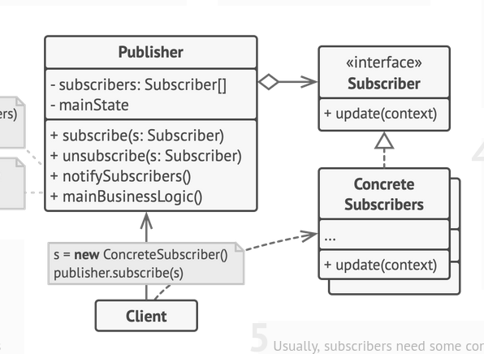

# Observer Pattern

We have a publisher (who has to notify a lot of people) and subscribers;
the subscribers can either make pull req by visiting him constantly to ask for new product 
or the publisher can make push req by broadcasting news to them

In this case ; all teh subscription detials need to be implemented in the Pubslusher class and 
it must interact with the subscribers via an Interface ONLY

The subscriber interface cna have an update method along with other stuff to notify them

