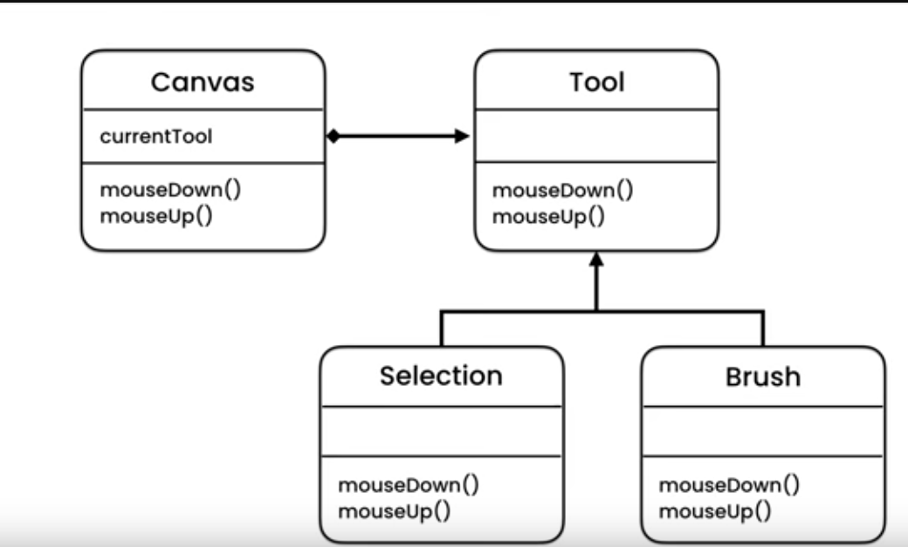

# State Pattern

Used when an obj has to behave diff depending upon what State it's in. 
> Eg ; a mobile button when pushed opens up lockscreen if the mobile is locked; locks the screen when the mobile is open; when battery is low then open battery level screen

So we declare an abstract class Tool and pass it in as a dependency in our _canvas_ or _context_ class and depending upon what kind of tool is initailized etiher selection or brush it behaves accordingly

Tool is abstract class whihc should have been an implementation of a Tool interface ; but classes Selection and Brush extend from Tool

Hence; instead of using extnesive liens of switch statemeents we make a class out of each of our machine states like locked/open/batteryLow and make them implement ann abstract class and pass that as dependency in our Context Class (the one handlign the UI or screen)

