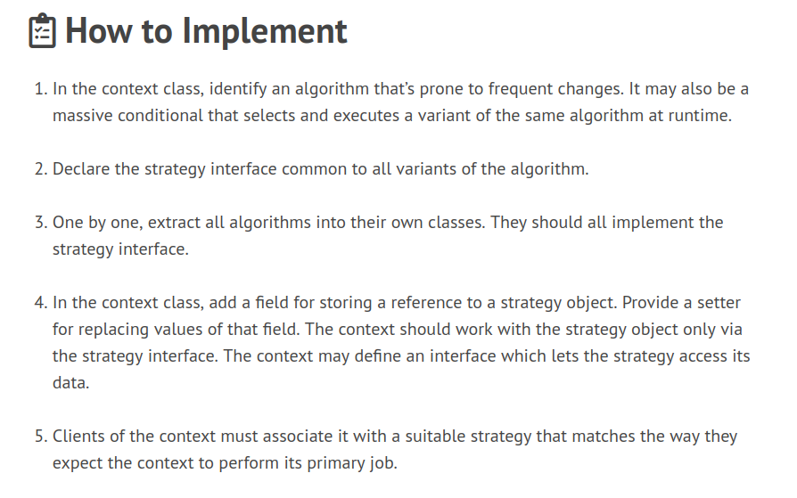
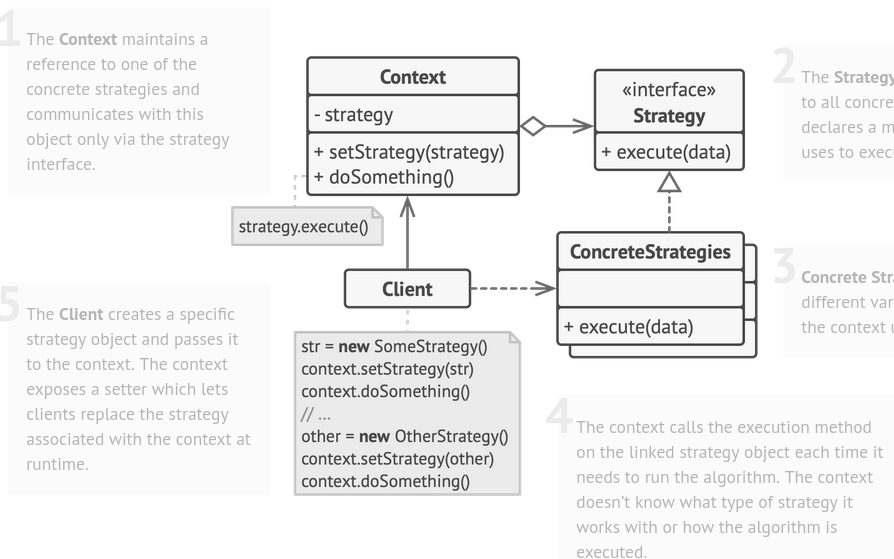

# Strategy Pattern

When we have multiple algos for a task ; like a user has the choice of calculating hte shortest route between two points via

- Bus
- Cab
- Walk
- Train

Then for each we need separate algo or use cases; hence it's wiser to separate each Algo in its' own class and encapsualte thme in a general itnerface called Route

We can then store a ref to Route in our Navigator class and provide a setter to set the required algo on runtime by the user and calc results as such

Each of these ALGOs is called a strategy hence the name

