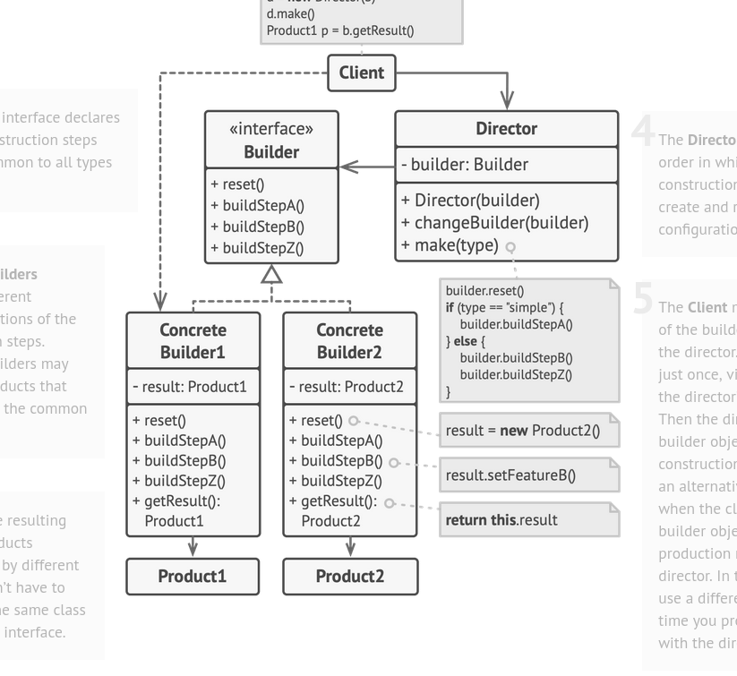

# Builder Pattern

Used when we have diff types of the same product; like a building could be castle or apartment or villa
each of these having massive req which could be passed in teh constrcutor but the constructor would het very long plus in many cases some vals might not even be neeeded

Therefore; we isolate the constrcution code into builder classes for each type and pass these builders to the Director or the engineer;
these builder classes act as specs to the engineer and he gives u the right property

