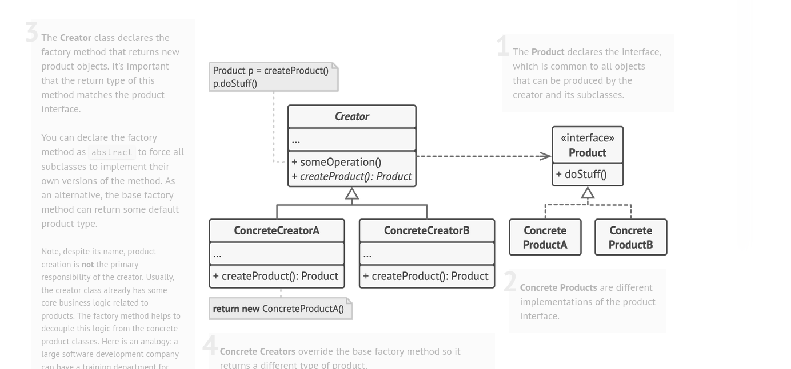

# Factory Design Pattern

Used when we want to encapsulate or abstract away the obj creation details of products

So instead of isntantiating classes in the client app via "new" keyword we can outsource the instnatiating part to a factory which will give us our obj depending upon our choice

I used it in local gov app to instante diff features like openingDashboard ; opening Chat Window etc on runtime

