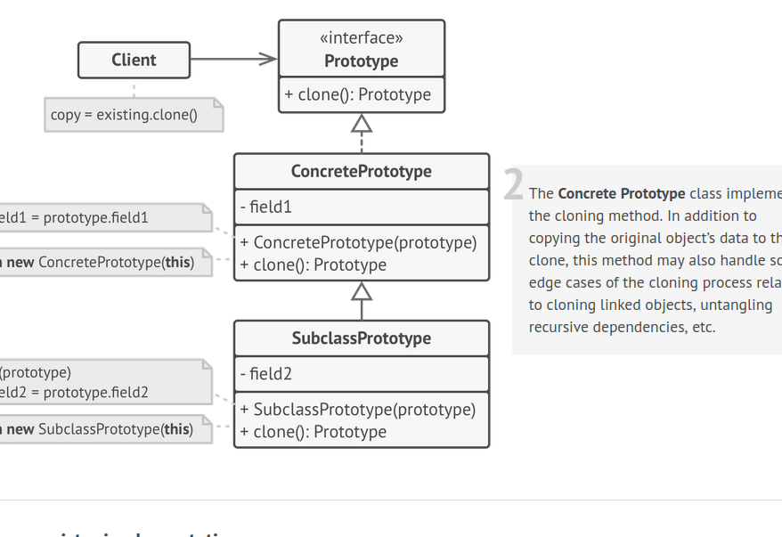

# Prototype Pattern

Often in our app we need clones of already existing objects; like specialized features; like in a game i wanna copy Earth with customized specs ; so instead of creating copies of already exisitng obj {which we should; explained later}
we can clone those objects

### Copy vs Clone

When we make copy of an obj we create another ref var whihc points to the smae mem addr

like
```cpp
Client clinet = new Client("config");
Clinet cpyClinet = client; // both clietn and cpyClinet point to the smae mem ; so changes in either reflect in tehs ame addr
Client cloneclinet = clinet.clone()
```




