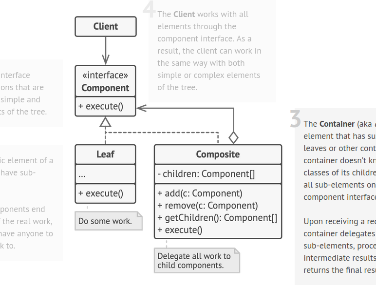

# Composite Pattern

used primarily when we have a tree strucutre in our porgram; like in a delivery service if we wanna calc the rpice of the whole package box ; then isntead of unwrapping it and inspecting each elem via a loop we can treat the package itself as a Box and as it it price

This works cuz ; the Box can contain either products (leaf having no children) or other boxes whihc can have prodcuts of its own or more boxes

So both the composite box (teh package) and the products ; implement the same interface

