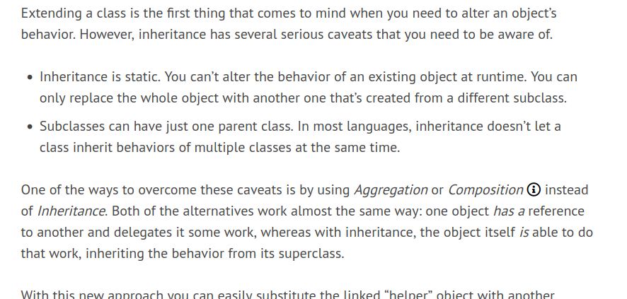
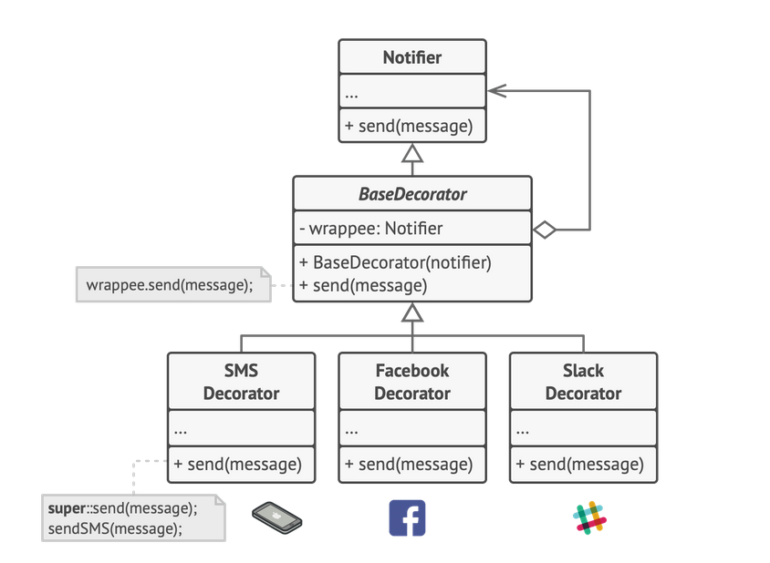
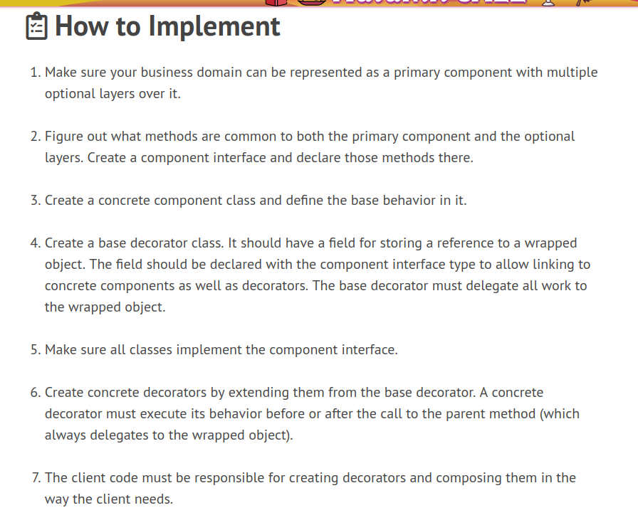

# Decorator Pattern

### Example:
Wearing clothes is an example of using decorators. When you’re cold, you wrap yourself in a sweater. If you’re still cold with a sweater, you can wear a jacket on top. If it’s raining, you can put on a raincoat. All of these garments “extend” your basic behavior but aren’t part of you, and you can easily take off any piece of clothing whenever you don’t need it.

### Def:
Decorator is a structural design pattern that lets you attach new behaviors to objects by placing these objects inside special wrapper objects that contain the behaviors.

We implement this by first making an interface for our base component which the client is gonna be referring to; with all the basic funcs

we then make a concrete class otu of it and present it to teh clinet

we make another **Decorator Class** for adding functionality to the base component
- that is composed of base component
  - >Inheritance vs Composition: 
- Delegation of the task is the essence fo the pattern here; the base component deosn't have the capaboltiy of the "special features" like if its a pizza tehn its doesn't have mozarella but it can delegate that task to Mozarella decorator to taht for it

### Guidelines:
- the decorator classes will obv extend the decorator
- decorator chaining how it works?

> Rememeber that Decorator Class also implements the same interface that base component implements ;in our case the Pizza interface
